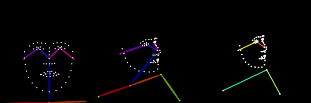

# ComfyUI-SkeletonRetarget



A ComfyUI custom node pack for skeleton retargeting and face mesh manipulation. Align driving video poses to reference images for consistent AI video generation, and reorient captured faces with texture-mapped 3D mesh rendering for video diffusion anchoring.

## Features

### Skeleton Retargeting
- **Pose Extraction** -- Convert DWPose/OpenPose keypoints into skeleton tensors (COCO-18, BODY-25, COCO-133)
- **Person Tracking** -- Follow a specific subject across video frames with torso-anchor matching
- **Automatic Retargeting** -- Compute scale, rotation, and offset transforms between skeletons using configurable body anchors
- **Relative & Absolute Modes** -- Transfer motion deltas or map poses directly to reference proportions
- **Visualization** -- Render retargeted skeletons to OpenPose-style control images with correct topology and coloring

### Face Mesh Retargeting (New)
- **MediaPipe Face Detection** -- Detect 478 face landmarks, head pose matrix, and blendshape coefficients per frame
- **3D Face Reorientation** -- Rotate the face mesh by euler angles in metric 3D space with perspective-correct projection
- **Textured Rendering** -- Rasterize the reoriented mesh using the original video frame as texture via per-triangle UV mapping
- **Facing Ratio Mask** -- Per-pixel confidence channel indicating texture trustworthiness (1.0 = frontal, 0.0 = grazing/stretched), designed to drive diffusion inpainting strength

## Installation

1. Navigate to your ComfyUI custom nodes directory:
    ```bash
    cd ComfyUI/custom_nodes/
    ```
2. Clone this repository:
    ```bash
    git clone https://github.com/cedarconnor/ComfyUI-Skeletonretarget.git
    ```
3. Install dependencies:
    ```bash
    cd ComfyUI-Skeletonretarget
    pip install -r requirements.txt
    ```
4. Restart ComfyUI. The MediaPipe face landmarker model (~4MB) downloads automatically on first use.

## Nodes

### Skeleton Retargeting

**Extract Skeleton From Pose** -- Converts DWPose/OpenPose detector output to normalized skeleton tensors. Supports largest-person selection, index-based selection, or cross-frame tracking.

**Compute Retarget Transform** -- Calculates scale, rotation, and anchor offset between a reference and driving skeleton. Anchor modes: hips, shoulders, neck, torso, auto.

**Apply Retarget Transform** -- Applies the computed transform to a skeleton sequence. Supports absolute positioning and relative motion transfer. Bounds handling: none, clamp, scale_to_fit, flag_only.

**Skeleton To OpenPose Image** -- Renders skeleton data into OpenPose-format control images. Supports COCO-18, BODY-25, and COCO-133 (hands/face).

### Face Mesh Retargeting

**MediaPipe Face Landmarker** -- Runs MediaPipe FaceLandmarker on input frames. Outputs 478 landmarks (normalized image-space), 4x4 head pose matrix, UV coordinates for texture mapping, and optional blendshape coefficients.

**Reorient Face Mesh** -- Rotates the detected face mesh by pitch/yaw/roll offsets. Converts landmarks to metric 3D using the head pose matrix, applies rotation around the face centroid, then projects back to image-space. Two modes:
- *Additive* (default) -- rotates relative to the current head pose
- *Absolute* -- strips original rotation and applies target orientation directly

**Render Textured Face Mesh** -- Rasterizes the reoriented mesh with the original video frame as texture. Uses per-triangle OpenCV affine warps. Outputs three channels:
- *rendered_face* (IMAGE) -- the textured face at the new orientation
- *face_mask* (MASK) -- binary silhouette of the face geometry
- *facing_ratio_mask* (MASK) -- soft confidence gradient for diffusion compositing

## Usage

### Skeleton Retargeting Pipeline

```
Reference Image -> DWPose -> Extract Skeleton From Pose -> (reference_skeleton)
Driving Video   -> DWPose -> Extract Skeleton From Pose -> (driving_skeleton, skeleton_sequence)

(reference_skeleton, driving_skeleton) -> Compute Retarget Transform -> (transform)
(skeleton_sequence, transform)         -> Apply Retarget Transform   -> (retargeted_sequence)
(retargeted_sequence)                  -> Skeleton To OpenPose Image -> IMAGE (for ControlNet)
```

### Face Mesh Retargeting Pipeline

```
Video Frames -> MediaPipe Face Landmarker -> (landmarks, face_matrix, landmark_uvs)

(landmarks, face_matrix, yaw=20) -> Reorient Face Mesh -> (transformed_landmarks, vertex_normals)

(transformed_landmarks, vertex_normals, landmark_uvs, video_frames)
    -> Render Textured Face Mesh -> (rendered_face, face_mask, facing_ratio_mask)
```

The facing ratio mask feeds directly into video diffusion as an inpainting confidence channel. Where the mask is bright, diffusion preserves the real face texture. Where it falls off, diffusion generates freely. The threshold and feather parameters control the transition zone.

## Dependencies

- `opencv-python` -- Image processing and per-triangle rendering
- `numpy` -- Array operations
- `mediapipe>=0.10.14` -- Face landmark detection (tasks API)
- `torch>=2.0` -- Provided by ComfyUI

## License

MIT License.
